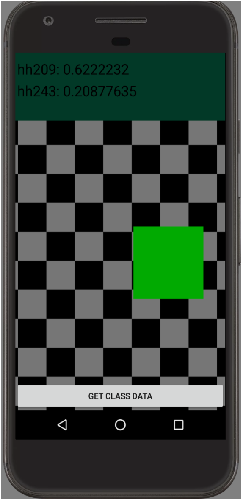
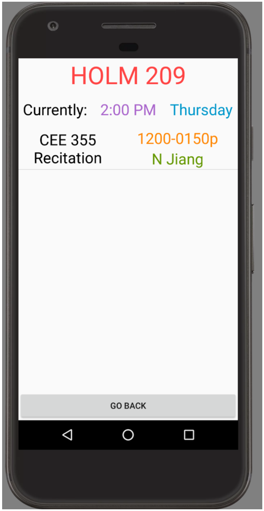

The UH Room Availability App is an Android application I helped create for my EE396 project. The project helped me learn how to develop and design an android application.    

The application utilizes a TensorFlow image recognition model to identify what classroom is shown through Android camera; then it displays what classes are occupying that room for the day. TensorFlow is a deep neural network created by Google to perform tasks by constant training and positive reinforcements. The application was written in Java using Android Studio, an integrated development environment for Google's Android mobile operating system. Our data was parsed from the UH Manoa Class Availability Website using an HTML parser called ParseHub and stored in an SQLite database within the application.            

My responsibilities in this project was parsing data from our school's class availability website, creating an SQLite database to store information about each course, and create the display to show the results from the image recognition model. In this project I gained experience with mobile application development, HTML parsing, and SQLite databases.      
 
Source: <a href="https://github.com/kekupua/EE396"><i class="large github icon"></i>UHRoomAvailabilityApp</a>
