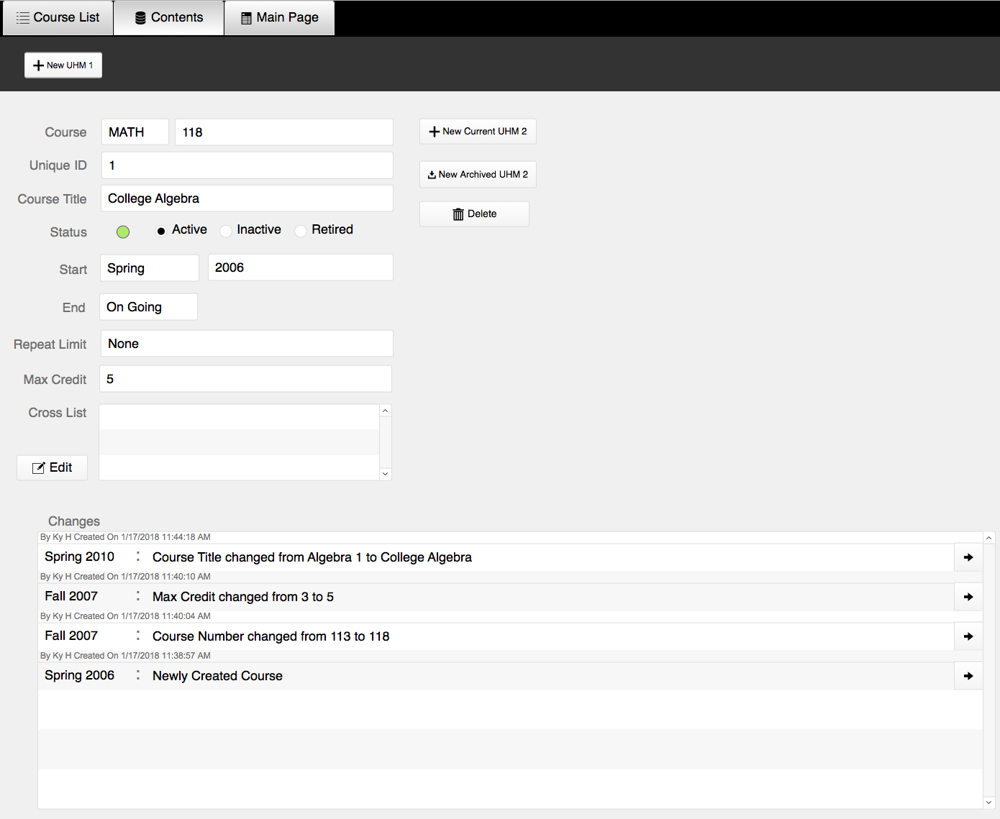
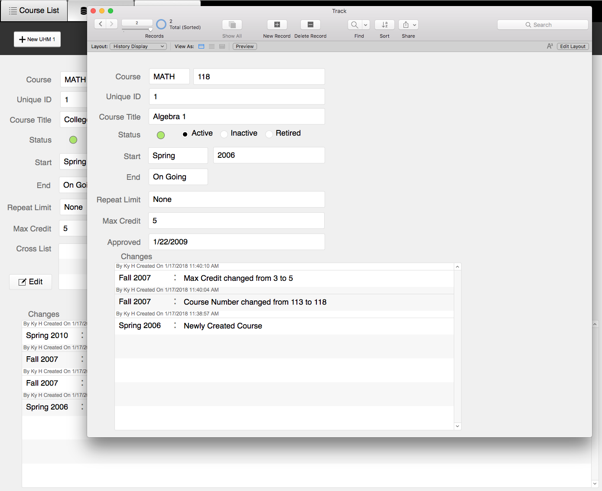
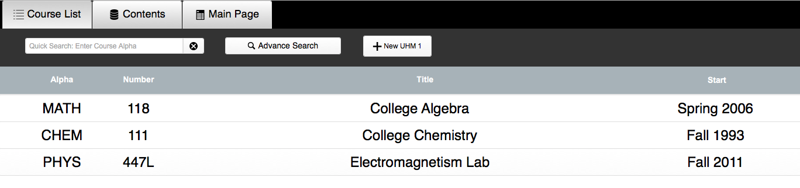

The UHM Curriculum Database is a database system I designed and built using FileMaker Pro 16 as a part of my job for the College of Natural Sciences. It is used to manage and archive all curriculum changes for all the departments under the college since 1986. 

Here are some pictures showing what the database system looks like and some of its features (the course information below is made up just to show how it works):

This is the main contents page where the current information of the course is displayed. 

     

There is also a history log of each course and how it has changed over time.  

     

Shown below is the navigation page that displays every single course so far.
In actual use, this page holds thousands of records which can be filtered out to show any specific record(s).  

  
