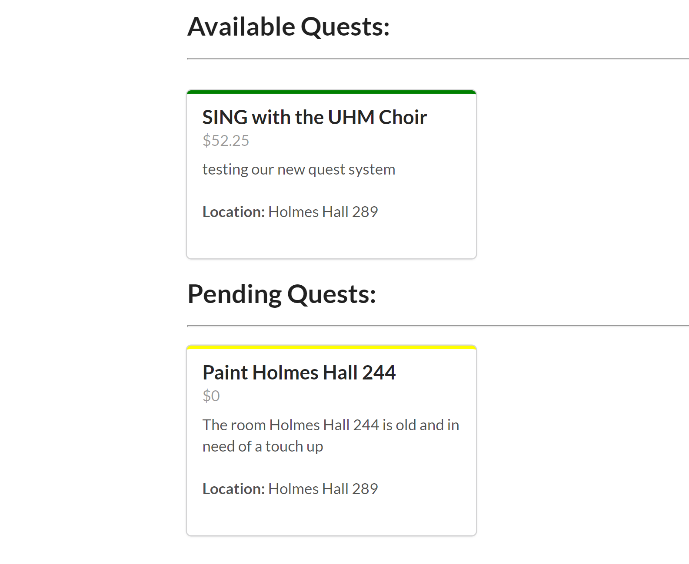
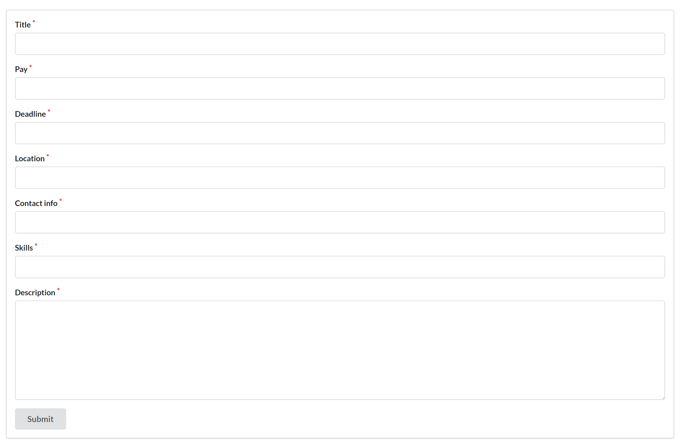
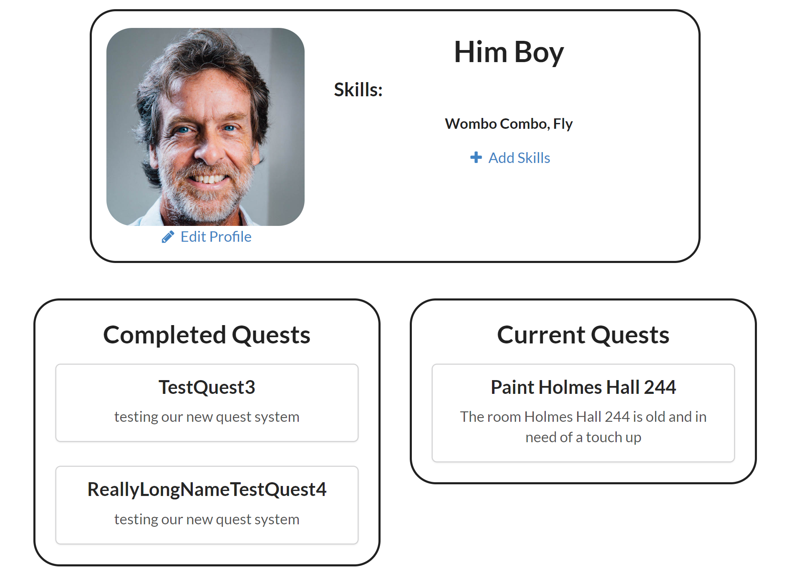

Quest boards is a website that me and two other teammates have worked on. The purpose of short term jobs is to allow users to manage jobs by keeping track of the jobs that they posted or have accepted. Our jobs are named as quests on this site.    

Here are some pictures showing what the site has to offer:

This is the main page where all the quests are displayed. Available quests can be requested if you want to take the job, and pending quests are ones that are currently taken by someone else. You can also create your own quests as well for others to take.    

       

There is also a page where you can make your own profile and customize it for others to view. You can add skills, change your profile picture, and display what quests you currently have taken, and quests that are completed.  

  
